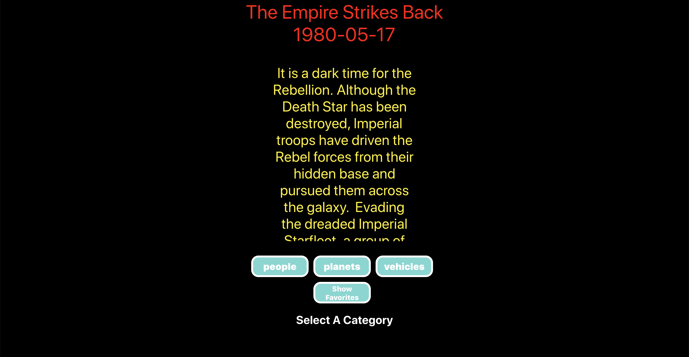
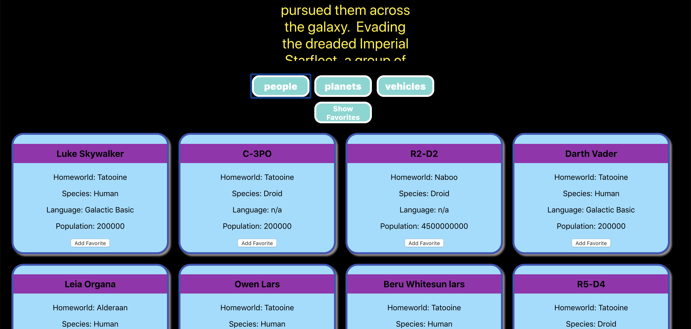
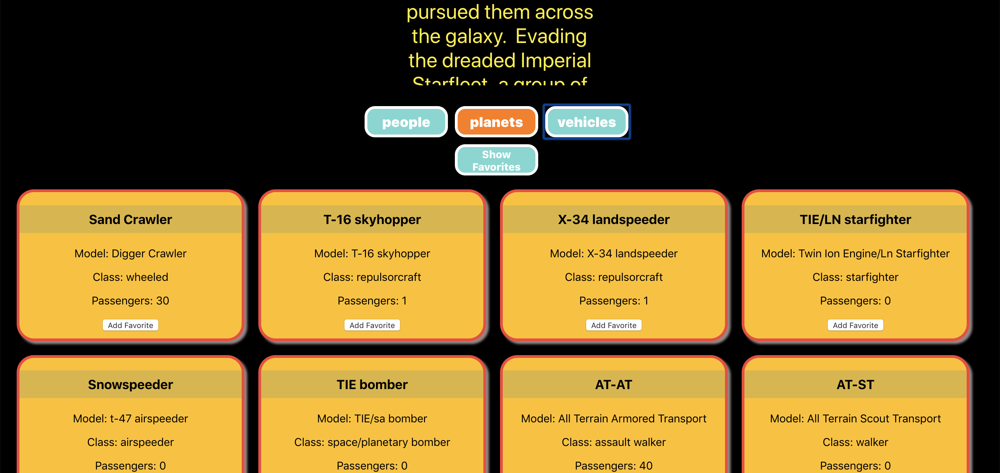

# SWAPI-BOX!

## Project By: Duy Vu

# Getting Started:
- Run npm install
- Run npm start

# For Testing: 
- Run npm test

# Languages:
- React
- Scss

## Goal:
- For this solo project I learned how to do complex fetch calls. This required me to understand promises being made/resolved versus what promises were being rejected. Understanding and following this pathing was very important to doing this project. If the information was not coming in at the right time you will not get back what information.

## My-Project

